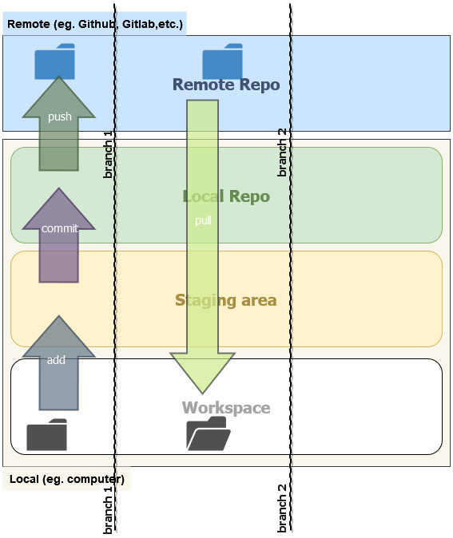

# Intro to Git

## The Basics
<p align="center">
  
</p>


### Installing git
If using Linux or MacOs, `git` should probably be present already. If not, follow the insttructions [here][6].

For Windows, download the installer from [here][5].

### Cloning a repo
Click on the green `Code` button on the repo page, copy the `https` link. Open a terminal and move to desired folder. Then run the `git clone` command along with the copied url to create a local copy of the repo.

So, to clone this repo, the command would be
```bash
git clone https://github.com/hsrwrobotics/hello-git.git
```

### Forking a repo

Click on the `Fork` button  to create a remote copy first. Then go to this forked repo page and clone it(Notice the url of the fork is different from the original). 

### Pushing to a repo
1. `git add <files paths>`
2. `git commit -m "<commit message>"`
3. `git push <remote> <branch>`

```bash
git add README.md
git commit -m "First commit"
git push origin main
```

### Pulling a repo

```bash
git pull origin main
```

## Hosting a static website

### Creating a branch
```bash
git checkout -b pages
```

### Pushing to branch
```bash
git add README.md
git commit -m "updating name"
git push origin pages
```

## Participants
- Thomas

## References
- [Particles JS library][3]
- [Particles JS configurator][2]
- [Ben's portfolio][4]
- [Bootstrap footers][1]


<!-- Reference urls -->
[1]: https://getbootstrap.com/docs/5.1/examples/footers/
[2]: https://vincentgarreau.com/particles.js/
[3]: https://github.com/VincentGarreau/particles.js
[4]: https://benrogers.dev/
[5]: https://git-scm.com/download/win
[6]: https://git-scm.com/book/en/v2/Getting-Started-Installing-Git